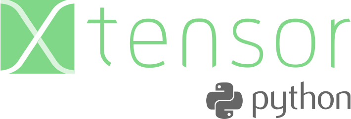

.. Copyright (c) 2016, Johan Mabille and Sylvain Corlay

   Distributed under the terms of the BSD 3-Clause License.

   The full license is in the file LICENSE, distributed with this software.

Python bindings for the xtensor_ C++ multi-dimensional array library.

Introduction
------------

What are ``xtensor`` and ``xtensor-python``?

 - ``xtensor`` is a C++ library for multi-dimensional arrays enabling numpy-style broadcasting and lazy computing.
 - ``xtensor-python`` enables inplace use of numpy arrays with all the benefits from ``xtensor``

     - C++ universal functions and broadcasting 
     - STL - compliant APIs.

The `numpy to xtensor cheat sheet`_ from the ``xtensor`` documentation shows how numpy APIs translate to C++ with ``xtensor``.

The Python bindings for ``xtensor`` are based on the pybind11_ C++ library, which enables seemless interoperability between C++ and Python.

Enabling numpy arrays in your C++ libraries
-------------------------------------------

Instead of exposing new types to python, ``xtensor-python`` enables the use of NumPy_ data structures from C++ using Python's `Buffer Protocol`_.

In addition to the basic accessors and iterators of ``xtensor`` containers, it also enables using numpy arrays with ``xtensor``'s expression system.

Besides ``xtensor-python`` provides an API to create *Universal functions* from simple scalar functions from your C++ code.

Finally, a cookiecutter template project is provided. It takes care of the initial work of generating a project skeleton for a C++ extension based on ``xtensor-python`` containing a few examples, unit tests and HTML documentation. Find out more about the xtensor-python-cookiecutter_.

``xtensor`` and ``xtensor-python`` require a modern C++ compiler supporting C++14. The following C++ compilers are supported:

- On Windows platforms, Visual C++ 2015 Update 2, or more recent
- On Unix platforms, gcc 4.9 or a recent version of Clang

Licensing
---------

We use a shared copyright model that enables all contributors to maintain the
copyright on their contributions.

This software is licensed under the BSD-3-Clause license. See the LICENSE file for details.

.. toctree::
   :caption: INSTALLATION
   :maxdepth: 2

   installation

.. toctree::
   :caption: USAGE
   :maxdepth: 2

   basic_usage
   array_tensor
   numpy_capi
   cookiecutter

.. toctree::
   :caption: API REFERENCE
   :maxdepth: 2

   api_reference

.. toctree::
   :caption: DEVELOPER ZONE

   dev_build_options
   compilers
   releasing

.. _NumPy: http://www.numpy.org
.. _`Buffer Protocol`: https://docs.python.org/3/c-api/buffer.html
.. _`numpy to xtensor cheat sheet`: http://xtensor.readthedocs.io/en/latest/numpy.html 
.. _xtensor: https://github.com/xtensor-stack/xtensor
.. _pybind11: https://github.com/pybind/pybind11 
.. _xtensor-python-cookiecutter: https://github.com/xtensor-stack/xtensor-python-cookiecutter 
